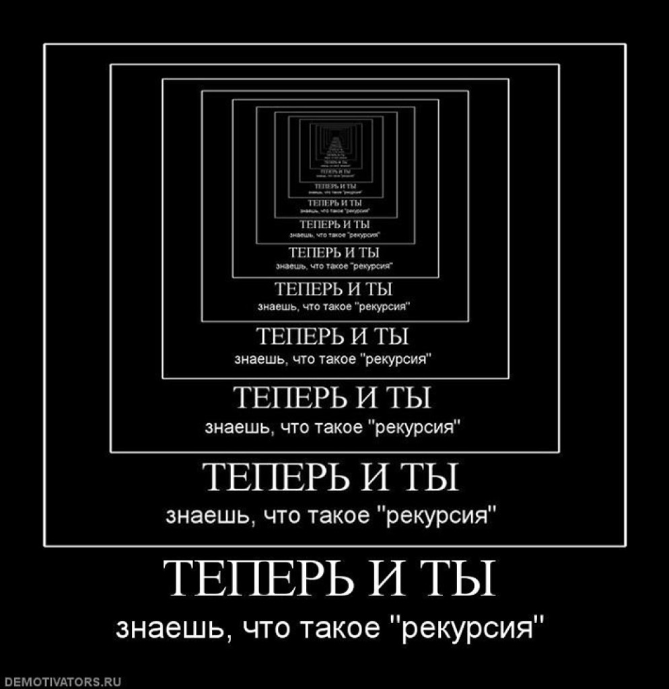

# **Матигоров Никита Иванович BACKEND 1**
## *Что мне показалось интересным?*
Интересным я отметил для *себя*:
+ Git;
+ GitHub;
+ Рекурсия **(Для меня это было открытие)**;

+ CI;


+ Visual Stu**dio** Code
## Вывод
В конце я хочу сказать, что курс от КОД`а мне понравился.

---
А вот небольшой код:
```
print('Hello, World!')
```